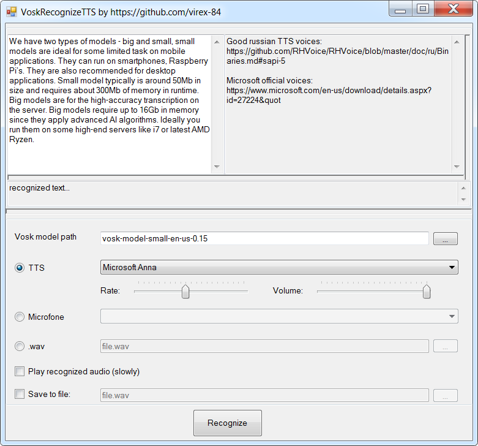

[README_RU](README_RU.md)

# VoskRecognizeTTS
Utility for testing speech recognition language models "Vosk" (20+ languages and dialects) https://alphacephei.com/vosk/

Possibilities:
1. Speech generation using the TTS (Text to Speech) text-to-speech converter built into Windows, with the transfer of this speech to the “Wax” recognition engine
2. Speech recognition from microphone
3. Speech recognition from .wav audio file
4. Ability to save generated TTS speech or audio from a microphone to a .wav file
5. Ability to play generated speech using TTS
6. Application localization

# Components used:
- Vosk - speech engine "Vosk"
- NAudio - library for working with audio
- Newtonsoft.Json - library for working with json

# Development tool
Microsoft Visual Studio Community 2019

# Preparation
1. Download and unpack the required model from the Vosk website: https://alphacephei.com/vosk/models
1. Download and install Russian TTS engines RHVoice: https://github.com/RHVoice/RHVoice/blob/master/doc/ru/Binaries.md#sapi-5
2. Download and install official TTS engines from Microsoft: https://www.microsoft.com/en-us/download/details.aspx?id=27224&quot
3. Run the VoskRecognizeTTS utility, insert text, specify the path to the Vosk model, select the appropriate TTS engine (if the text is in English, select the appropriate TTS), click the "Recognize" button
4. Recognized words are enclosed in square quotes and are also displayed in a separate TextBox