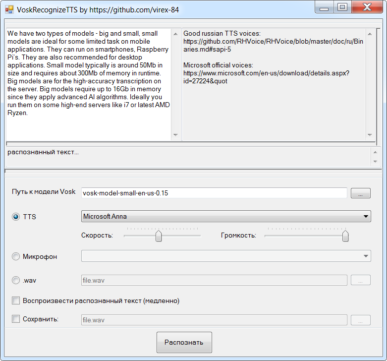

[README_EN](README.md)

# VoskRecognizeTTS
Утилита для тестирования языковых моделей распознавания речи "Воск" (20+ языков и диалектов) https://alphacephei.com/vosk/

Возможности:
1. Генерация речи с помощью встроенного в Windows преобразователя текста в речь TTS (Text to Speech), с передачей этой речи в движок распознавания "Воск"
2. Распознавание речи с микрофона
3. Распознавание речи с аудиофайла .wav
4. Возможность сохранить сгенерированную TTS речь, либо аудио с микрофона в .wav файл
5. Возможность воспроизвести сгенерированную речь с помощью TTS
6. Локализация приложения

# Используемые компоненты:
- Vosk - движок речи "Воск"
- NAudio - библиотека для работы с аудио
- Newtonsoft.Json - библиотека для работы с json

# Средство разработки
Microsoft Visual Studio Community 2019

# Подготовка
1. Скачать и распаковать необходимую модель с сайта "Воск": https://alphacephei.com/vosk/models
1. Скачать и установить русские TTS движки RHVoice:  https://github.com/RHVoice/RHVoice/blob/master/doc/ru/Binaries.md#sapi-5
2. Скачать и установить официальные TTS движки от Microsoft: https://www.microsoft.com/en-us/download/details.aspx?id=27224&quot
3. Запустить утилиту VoskRecognizeTTS, вставить текст, указать путь к Vosk модели, выбрать соответствующий TTS движок (если текст на английском - выбрать сооветствующий TTS), нажать кнопку "Распознать"
4. Распознанные слова заключаются в квадратные кавычки, а так же отображаются в отдельном TextBox